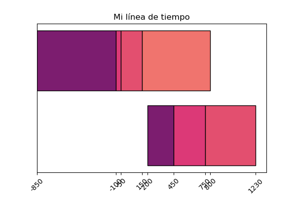

# Timeline: Simple utility for building simple timelines

This document updated: 2020-08-20

## Objective

To create a simple tool for building **simple** timelines with minimal interaction, **aimed at tech-newbies.**

That last part is extra important.

## Requirements

- Only tested with Python 3
- numpy
- matplotlib
- pandas
- palettable

The module currently has 3 modes:

1. `simple_timeline` creates a `.png` image with proper scaling, but no labels or other data.
2. `simple_timeline_fig` creates a simple `matplotlib` figure with axis and several series of data.
3. `timeline_from_csv` creates a mutli-line figure using a simple `.csv` file specifying timeline groups, priorities and lengths.

## Simple documentation

### `simple_timeline`

The most basic way of using this is with an array of "transition" years. For instance, the command

```python
y = [-250, 0, 250, 750]
simple_timeline(y)
```

Produces:


It's possible to configure the colors, width and height:

```python
y = [0, 250, 500, 750, 1000]
c = [(1.0, 0.0, 0.0),
     (0.0, 0.0 ,1.0),
     (0.0, 1.0, 0.0),
     (0.5, 0.5, 0.5),
     (0.7, 0.7, 0.7)]
simple_timeline(y, w=250, h=250, my_colors=c)
```

Produces:


### `simple_timeline_fig`

You can use this with a nested array:

```python
my_years = [[200, 450, 750, 1230],
            [-850, -100, -50, 150, 800]]

simple_timeline_fig(my_years)
```

Produces:



### `timeline_from_csv`

Assuming the following file:

```
group_name,group_order,name,start,stop
Antigua Grecia, 1, Preclásico, -1200, -750
Antigua Grecia, 1, Clásico, -750, -250
Antigua Grecia, 1, Posclásico, -250, 150
Mesoamérica, 2, Preclásico Mesoamericano, 0, 750
Mesoamérica, 2, Clásico Mesoamericano, 750, 1250
Mesoamérica, 2, Posclásico Mesoamericano, 1250, 1521
Edad Media, 3, Uno, 800, 1200
Edad Media, 3, Dos, 1200, 1700
Edad Media, 3, Tres, 1700, 1750
```

...and running:

```python
timeline_from_csv('years.csv', legend=False)
```

Produces:


## TODO / Help wanted

- An **easy** way of implementing more colors (`palettable` is chosen because it has many colormaps ready to use out of the box, but other solutions are welcome). User-defined palettes would be preferable.
- A simple GUI (I have yet to learn `tkinter`)
- Better image options (aspect ratio, dpi...)
- Cleaner interface (`tight_layout`, or something like that)